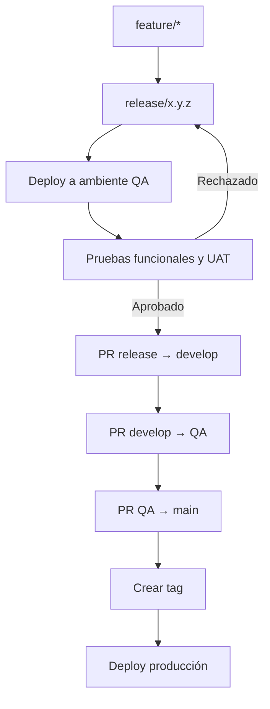
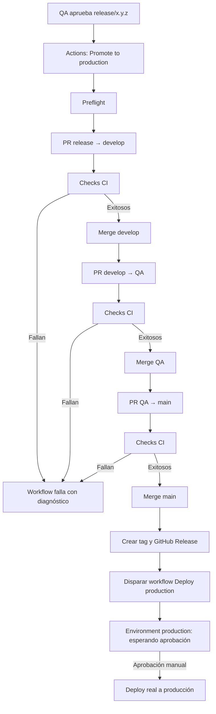
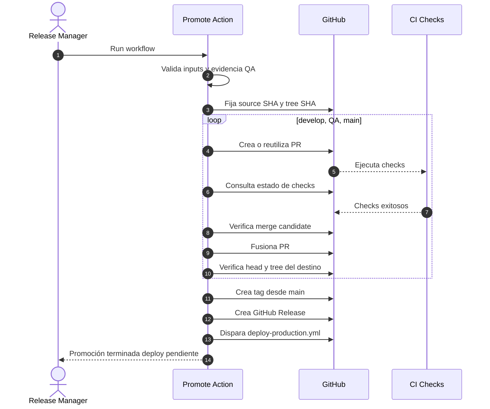
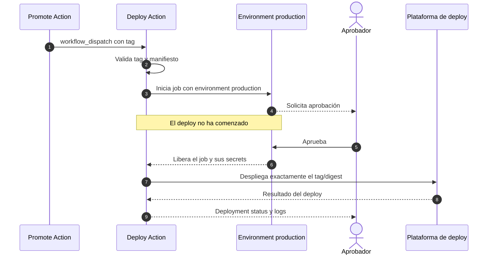
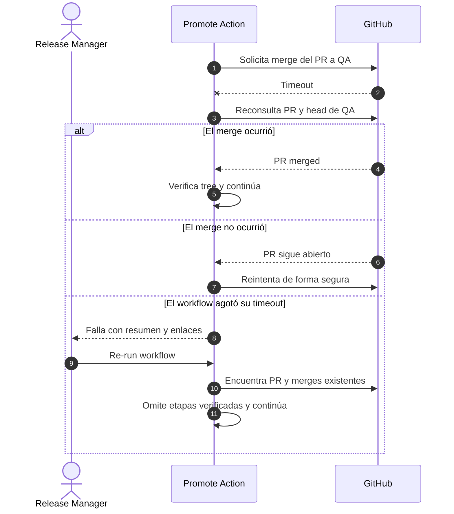
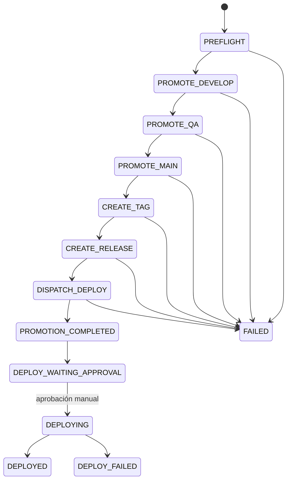

:::toc
:::

:::pagebreak
:::

# Diseño técnico: promoción de releases solo con GitHub Actions

**Estado:** Propuesta simplificada  
**Audiencia:** DevOps, Platform Engineering, QA y equipos de desarrollo  
**Versión:** 2.0 — arquitectura Actions-only  
**Fecha:** 2026-08-11  
**Flujo:** `release/* → develop → QA → main → tag → aprobación manual del deploy`

---

| Column 1 | Column 2 | Column 3 |
| --- | --- | --- |
| asfa | asf | asf |
| gdfas | sadf | gsdfg |

hjihih

## 1. Resumen ejecutivo

La solución se implementará **exclusivamente dentro de GitHub**. No requiere una API propia, servicio web, base de datos, cola, dashboard ni receptor de webhooks.

Una GitHub Action manual llamada **Promote to production** ejecutará, en un único workflow:

1. validar la release aprobada por QA;
2. crear y fusionar el PR `release/* → develop`;
3. crear y fusionar el PR `develop → QA`;
4. crear y fusionar el PR `QA → main`;
5. crear el tag desde `main`;
6. crear el GitHub Release;
7. disparar el workflow de deploy a producción.

El workflow de deploy será independiente y utilizará el environment protegido `production`. Ese workflow quedará esperando la **aprobación manual del usuario después de creado el tag**. Solo tras esa aprobación se ejecutará el despliegue real.

```text
Promote to production
        ↓
release → develop → QA → main → tag
        ↓
Deploy production queda pendiente
        ↓
Aprobación manual
        ↓
Deploy real a producción
```

El estado se consulta directamente en:

- el run de GitHub Actions;
- los PR creados;
- los checks de cada PR;
- el tag y el GitHub Release;
- el deployment del environment `production`.

No existe otro sistema de estado.

---

## 2. Objetivos

### 2.1 Objetivos funcionales

- Tener un botón manual **Promote to production** en cada repositorio.
- Automatizar toda la promoción de ramas sin intervención entre etapas.
- Respetar los checks de CI antes de cada merge.
- Crear el tag únicamente desde el commit final de `main`.
- Crear un GitHub Release con trazabilidad de toda la promoción.
- Disparar el deploy después del tag.
- Solicitar aprobación humana únicamente para el deploy real a producción.
- Permitir reejecutar el workflow sin duplicar PR, merges, tags o releases.

### 2.2 Objetivos no funcionales

- Mantener toda la operación dentro de GitHub.
- Minimizar componentes y costo operacional.
- Usar permisos mínimos y credenciales de corta duración.
- Poder auditar el proceso desde Actions, PR y Releases.
- Detectar si una rama intermedia contiene cambios no probados.
- Evitar dos promociones concurrentes en el mismo repositorio.

### 2.3 Fuera de alcance

- Una API o interfaz web propia.
- Una base de datos de promociones.
- Un servicio permanente de GitHub App.
- Procesamiento de webhooks.
- Un dashboard externo.
- Rollback automático de producción.
- Resolución automática de conflictos Git.
- Aprobación automática del deploy a producción.

---

## 3. Flujo actual

1. Se acumulan cambios en `release/x.y.z`.
2. La rama release se despliega al ambiente QA.
3. QA ejecuta pruebas funcionales y UAT.
4. QA aprueba la release.
5. DevOps realiza manualmente los PR y merges.
6. Se crea el tag desde `main`.
7. Se despliega a producción.



### 3.1 Problemas del proceso manual

- Selección incorrecta de rama o versión.
- PR creados en orden incorrecto.
- Espera y revisión manual de checks.
- Tags creados desde el commit equivocado.
- Poca trazabilidad entre QA, PR, tag y deploy.
- Repetición de pasos en cada repositorio.
- Riesgo de promover cambios adicionales desde una rama intermedia.

---

## 4. Flujo propuesto

### 4.1 Vista general



### 4.2 Inputs de la Action

El usuario ejecuta **Actions → Promote to production → Run workflow** e ingresa:

| Input | Ejemplo | Requerido | Uso |
|---|---|---:|---|
| `release_branch` | `release/2.4.0` | Sí | Rama que QA probó. |
| `version` | `v2.4.0` | Sí | Tag que se creará. |
| `qa_evidence` | URL del run de QA | Sí | Evidencia de aprobación. |
| `change_ticket` | `CHG-1042` | No | Trazabilidad corporativa. |
| `dry_run` | `false` | Sí | Solo validar, sin cambios. |
| `confirmation` | `PROMOTE` | Sí | Evita ejecuciones accidentales. |

### 4.3 Resultado esperado

Al finalizar la Action de promoción deben existir:

- tres PR fusionados;
- los checks exitosos de cada etapa;
- un tag que apunta al head final de `main`;
- un GitHub Release;
- un manifiesto de promoción adjunto al Release;
- un workflow de deploy en espera de aprobación en `production`.

La Action de promoción puede terminar exitosa aunque el deploy todavía no haya sido aprobado. Son dos procesos separados intencionalmente.

---

## 5. Arquitectura Actions-only

```mermaid
flowchart LR
    U["Release Manager"] -->|"workflow_dispatch"| P["promote-to-production.yml"]
    P --> V["Preflight"]
    V --> S1["Reusable workflow: promote-stage"]
    S1 --> PR1["PR a develop"]
    PR1 --> S2["Reusable workflow: promote-stage"]
    S2 --> PR2["PR a QA"]
    PR2 --> S3["Reusable workflow: promote-stage"]
    S3 --> PR3["PR a main"]
    PR3 --> T["Tag + GitHub Release"]
    T --> D["deploy-production.yml"]
    D --> ENV["Environment production"]
    ENV -->|"Aprobación manual"| PROD["Deploy"]

    GH["GitHub PR / Checks / Releases"] --- P
```



### 5.1 Componentes

| Componente | Responsabilidad |
|---|---|
| `.github/workflows/promote-to-production.yml` | Orquestar todas las etapas. |
| Workflow reutilizable `promote-stage.yml` | Crear/reutilizar PR, esperar checks, fusionar y verificar. |
| `.github/release-promotion.yml` | Configuración por repositorio. |
| `deploy-production.yml` | Esperar aprobación y desplegar el tag. |
| GitHub branch rules/rulesets | Bloquear pushes directos y exigir checks. |
| GitHub environment `production` | Solicitar la aprobación manual del deploy. |
| GitHub Actions artifacts/summary | Guardar evidencia del run. |
| GitHub Release | Conservar manifiesto y enlaces finales. |

### 5.2 Componentes que no existen

```text
No Promotion API
No backend del bot
No base de datos
No cola
No webhook receiver
No dashboard propio
No workers permanentes
```

La Action puede usar GitHub CLI o la API oficial de GitHub internamente para crear PR, consultar checks y crear tags. Eso no implica desplegar una API propia: son llamadas desde el runner directamente a GitHub.

---

## 6. Secuencias

### 6.1 Promoción hasta el tag



### 6.2 Aprobación posterior del deploy



### 6.3 Falla y reejecución



---

## 7. Estado del proceso

No se utilizará una máquina de estados externa. Los jobs del workflow representan el estado:



### 7.1 Dónde se observa cada estado

| Estado | Ubicación en GitHub |
|---|---|
| Preflight | Job Summary de la Action. |
| PR/checks | Pull request y job de la etapa. |
| Merge | Timeline del PR y head de rama. |
| Tag/Release | Releases del repositorio. |
| Esperando aprobación | Actions y Environments → production. |
| Deploy | Run de `deploy-production.yml` y deployment history. |

### 7.2 Manifiesto de promoción

La Action genera `promotion-manifest.json`:

```json
{
  "repository": "acme/payments-api",
  "version": "v2.4.0",
  "release_branch": "release/2.4.0",
  "source_sha": "abc123...",
  "tested_tree_sha": "def456...",
  "qa_evidence": "https://github.com/.../actions/runs/1234",
  "pull_requests": {
    "develop": 101,
    "qa": 102,
    "main": 103
  },
  "main_sha": "789abc...",
  "tag": "v2.4.0",
  "promotion_run_id": 987654321
}
```

Se publica como:

- artifact del workflow;
- asset del GitHub Release;
- resumen legible en `$GITHUB_STEP_SUMMARY`.

---

## 8. Garantía de que se promueve lo probado

### 8.1 Riesgo de ramas intermedias

```text
release/2.4.0: A ─ B ─ C        QA probó A+B+C
develop:       A ─ B ─ C ─ D    D todavía no fue probado
```

Si se fusiona `develop → QA`, el cambio `D` podría llegar a `main` y al tag.

### 8.2 Política recomendada: exact tree

Al iniciar la Action:

```text
source_sha      = head de release/x.y.z
tested_tree_sha = árbol Git de source_sha
```

Antes de cada merge se calcula o consulta el árbol del merge candidato:

```text
tree(merge_candidate) == tested_tree_sha
```

Después del merge se vuelve a validar:

```text
tree(target_head) == tested_tree_sha
```

Si no existe igualdad, la Action falla y no continúa con la siguiente rama.

### 8.3 Protección contra carreras

- Guardar el SHA de head y base usado para validar el PR.
- Releer ambos inmediatamente antes del merge.
- Exigir branch up-to-date o merge queue.
- Verificar nuevamente el destino después del merge.
- Usar `concurrency` para impedir dos workflows de promoción simultáneos.
- Bloquear o coordinar otros merges a `develop`, `QA` y `main` mientras dura la promoción.

El `concurrency` de Actions solo bloquea otras Actions; no bloquea merges humanos. Por eso las reglas de rama y el check de promoción siguen siendo necesarios.

### 8.4 Artefactos de aplicación

Cuando sea posible:

```text
build once → probar digest en QA → desplegar el mismo digest en producción
```

El tag identifica el código fuente y el manifiesto debe registrar el digest exacto del artefacto probado.

---

## 9. GitHub Actions: workflow principal

Archivo sugerido: `.github/workflows/promote-to-production.yml`.

```yaml
name: Promote to production

on:
  workflow_dispatch:
    inputs:
      release_branch:
        description: Release branch, for example release/2.4.0
        required: true
        type: string
      version:
        description: Version tag, for example v2.4.0
        required: true
        type: string
      qa_evidence:
        description: Approved QA evidence URL
        required: true
        type: string
      change_ticket:
        description: Optional change ticket
        required: false
        type: string
      dry_run:
        description: Validate without changing GitHub
        required: true
        default: false
        type: boolean
      confirmation:
        description: Type PROMOTE to continue
        required: true
        type: string

run-name: Promote ${{ inputs.version }} from ${{ inputs.release_branch }}

concurrency:
  group: release-promotion-${{ github.repository }}
  cancel-in-progress: false

permissions:
  contents: write
  pull-requests: write
  checks: read
  actions: write

jobs:
  preflight:
    uses: acme-platform/release-workflows/.github/workflows/preflight.yml@<PINNED_SHA>
    with:
      release_branch: ${{ inputs.release_branch }}
      version: ${{ inputs.version }}
      qa_evidence: ${{ inputs.qa_evidence }}
      confirmation: ${{ inputs.confirmation }}
      dry_run: ${{ inputs.dry_run }}
    secrets: inherit

  promote-develop:
    needs: preflight
    if: ${{ !inputs.dry_run }}
    uses: acme-platform/release-workflows/.github/workflows/promote-stage.yml@<PINNED_SHA>
    with:
      source_branch: ${{ inputs.release_branch }}
      target_branch: develop
      version: ${{ inputs.version }}
      tested_tree_sha: ${{ needs.preflight.outputs.tested_tree_sha }}
    secrets: inherit

  promote-qa:
    needs: [preflight, promote-develop]
    uses: acme-platform/release-workflows/.github/workflows/promote-stage.yml@<PINNED_SHA>
    with:
      source_branch: develop
      target_branch: QA
      version: ${{ inputs.version }}
      tested_tree_sha: ${{ needs.preflight.outputs.tested_tree_sha }}
    secrets: inherit

  promote-main:
    needs: [preflight, promote-qa]
    uses: acme-platform/release-workflows/.github/workflows/promote-stage.yml@<PINNED_SHA>
    with:
      source_branch: QA
      target_branch: main
      version: ${{ inputs.version }}
      tested_tree_sha: ${{ needs.preflight.outputs.tested_tree_sha }}
    secrets: inherit

  tag-and-release:
    needs: [preflight, promote-develop, promote-qa, promote-main]
    uses: acme-platform/release-workflows/.github/workflows/tag-and-release.yml@<PINNED_SHA>
    with:
      version: ${{ inputs.version }}
      release_branch: ${{ inputs.release_branch }}
      qa_evidence: ${{ inputs.qa_evidence }}
      tested_tree_sha: ${{ needs.preflight.outputs.tested_tree_sha }}
      develop_pr: ${{ needs.promote-develop.outputs.pull_request_number }}
      qa_pr: ${{ needs.promote-qa.outputs.pull_request_number }}
      main_pr: ${{ needs.promote-main.outputs.pull_request_number }}
    secrets: inherit

  request-production-deploy:
    needs: tag-and-release
    uses: acme-platform/release-workflows/.github/workflows/request-deploy.yml@<PINNED_SHA>
    with:
      version: ${{ inputs.version }}
    secrets: inherit
```

Este ejemplo muestra la estructura; los SHA de los workflows reutilizables deben reemplazarse por commits reales e inmutables.

### 9.1 Preflight

Debe validar:

- `confirmation == PROMOTE`;
- rama con patrón permitido;
- SemVer válido;
- tag no existente;
- release branch existente;
- QA evidence presente y asociada al mismo SHA/digest;
- repositorio configurado;
- branches destino existentes;
- ausencia de otro run activo por `concurrency`;
- protección de ramas esperada;
- permisos necesarios;
- posibilidad de crear PR sin conflicto;
- contenido compatible con `exact_tree`.

`dry_run` termina después de estas validaciones y no crea recursos.

### 9.2 Reusable workflow `promote-stage.yml`

Para cada etapa:

1. calcular una clave determinista de promoción;
2. buscar un PR existente con esa clave;
3. crear el PR si no existe;
4. esperar que GitHub calcule mergeability;
5. esperar checks requeridos;
6. comprobar que head/base no cambiaron;
7. comprobar el tree del merge candidato;
8. fusionar con el método configurado;
9. leer el nuevo head del destino;
10. comprobar `tree(target) == tested_tree_sha`;
11. devolver número de PR y merge SHA.

### 9.3 Tiempo máximo

Un run no debe esperar indefinidamente:

- timeout por checks sugerido: 60–90 minutos;
- timeout total sugerido: 4–5 horas;
- polling con intervalos moderados y backoff;
- si se agota el tiempo, el run falla con enlaces y puede reejecutarse;
- el re-run debe reutilizar los PR y saltar merges ya verificados.

---

## 10. Workflow de deploy con aprobación posterior

Archivo sugerido: `.github/workflows/deploy-production.yml`.

```yaml
name: Deploy production

on:
  workflow_dispatch:
    inputs:
      version:
        description: Version tag to deploy
        required: true
        type: string

run-name: Deploy ${{ inputs.version }} to production

concurrency:
  group: production-deploy-${{ inputs.version }}
  cancel-in-progress: false

permissions:
  contents: read
  deployments: write
  id-token: write

jobs:
  validate:
    runs-on: ubuntu-latest
    steps:
      - name: Validate immutable tag and promotion manifest
        run: ./scripts/validate-production-candidate.sh "${{ inputs.version }}"

  deploy:
    needs: validate
    runs-on: ubuntu-latest
    environment:
      name: production
    steps:
      - name: Checkout approved tag
        uses: actions/checkout@<PINNED_SHA>
        with:
          ref: ${{ inputs.version }}

      - name: Deploy exact artifact digest
        run: ./scripts/deploy-production.sh "${{ inputs.version }}"
```

### 10.1 Configuración del environment `production`

- Required reviewers: Release Managers o equipo autorizado.
- Prevent self-review: activado.
- Restringir el deployment a tags/refs permitidos.
- Secrets de producción únicamente en el environment.
- Deshabilitar bypass de protecciones cuando el plan de GitHub lo permita.

El job `validate` puede ejecutarse antes de la aprobación sin secretos de producción. El job `deploy` no debe acceder a esos secrets hasta que el environment sea aprobado.

### 10.2 Cómo se dispara

La última etapa de la promoción invoca explícitamente `workflow_dispatch` sobre `deploy-production.yml`, pasando el tag creado.

Esto evita depender de que un evento generado por `GITHUB_TOKEN` vuelva a disparar otro workflow. `workflow_dispatch` es el mecanismo explícito y auditable.

---

## 11. Autenticación: dos opciones sin backend

### 11.1 Opción A — `GITHUB_TOKEN`

Es la opción más simple:

- token automático por job;
- limitado al repositorio;
- permisos declarados en YAML;
- no requiere secretos permanentes.

Debe comprobarse en un piloto que:

- puede crear y fusionar PR bajo las reglas actuales;
- los checks requeridos se ejecutan como se espera;
- puede crear el tag y Release;
- puede disparar el workflow de deploy.

Los eventos creados con `GITHUB_TOKEN` tienen restricciones para evitar recursión. Por eso se recomienda disparar explícitamente los workflows dependientes mediante `workflow_dispatch` o llamar workflows reutilizables.

### 11.2 Opción B — GitHub App solo como identidad

Si `GITHUB_TOKEN` no puede operar bajo los rulesets o no dispara correctamente la CI existente, se puede registrar un GitHub App mínimo llamado, por ejemplo, `release-promotion-bot`.

Este App:

- **no tiene backend**;
- **no expone API**;
- **no procesa webhooks**;
- solo sirve para generar un installation token dentro de la Action;
- se instala únicamente en los repositorios habilitados.

La Action genera un token temporal usando el App ID y la private key almacenados como secrets de organización. El token se utiliza para crear PR, merges, tags y releases.

Permisos sugeridos:

| Permiso | Nivel |
|---|---:|
| Contents | Write |
| Pull requests | Write |
| Checks | Read |
| Commit statuses | Read |
| Actions | Write/Read |
| Metadata | Read |

No se requieren webhooks ni permisos de administración en runtime.

### 11.3 Recomendación

Comenzar el piloto con `GITHUB_TOKEN`. Si las protecciones o la ejecución de CI lo impiden, usar el GitHub App como **identidad técnica solamente**, manteniendo toda la lógica en Actions.

---

## 12. Protección de ramas y tags

| Ref | Reglas recomendadas |
|---|---|
| `release/*` | CI requerida; PR para cambios; sin force-push. |
| `develop` | PR obligatorio; checks requeridos; up-to-date o merge queue; sin push directo. |
| `QA` | PR obligatorio; checks requeridos; up-to-date o merge queue; sin push directo. |
| `main` | PR obligatorio; checks requeridos; CODEOWNERS cuando aplique; sin push directo. |
| `v*` | Restringir creación; impedir modificación/borrado; patrón SemVer. |

### 12.1 Reviews de los PR de promoción

Como el objetivo es que la Action avance sin intervención hasta el tag, la política debe elegir una de estas opciones:

1. No exigir review humana adicional para PR de promoción y confiar en la autorización del `workflow_dispatch`, evidencia QA y checks.
2. Permitir que la identidad del GitHub App omita **solo** la regla de review en los PR gestionados por la Action.
3. Mantener reviews obligatorias, aceptando que la promoción ya no será completamente automática.

La opción recomendada para el requisito actual es la primera o segunda. En ningún caso se deben omitir:

- checks de CI;
- validación del tree probado;
- prohibición de force-push;
- protección del tag;
- aprobación manual del deploy.

### 12.2 El approval de producción no protege el merge a `main`

En este diseño, `main` y el tag se crean **antes** del approval. La aprobación protege el deploy, no el merge.

Esto significa:

- el código puede estar en `main` sin estar desplegado;
- el tag puede existir sin estar desplegado;
- el GitHub Release debe mostrar el estado “pendiente de deploy” hasta que producción termine;
- si se necesita aprobación antes de `main`, sería un requisito diferente y habría que añadir un gate al PR.

---

## 13. Configuración por repositorio

Archivo sugerido: `.github/release-promotion.yml` en la rama default.

```yaml
schema_version: 1
enabled: true

branches:
  release_pattern: "release/*"
  develop: "develop"
  qa: "QA"
  main: "main"

promotion:
  content_policy: "exact_tree"
  merge_method: "merge"
  use_merge_queue: true
  checks_timeout_minutes: 90

required_checks:
  - "ci/build"
  - "ci/test"
  - "security/scan"

release:
  tag_pattern: "v{version}"
  create_github_release: true
  attach_manifest: true

deploy:
  workflow: "deploy-production.yml"
  environment: "production"
  approval_after_tag: true
```

### 13.1 Reglas de configuración

- Leer el archivo siempre desde la rama default protegida.
- Validarlo contra JSON Schema.
- No permitir que inputs del usuario reduzcan checks o controles.
- Versionar los cambios del esquema.
- Fijar los workflows reutilizables por commit SHA.
- Aplicar valores centrales obligatorios desde el repositorio de Platform.

---

## 14. Operaciones contra GitHub

### 14.1 No hay API propia

El diseño no define endpoints como `/promotions`, `/status` o `/resume`. Tampoco recibe eventos o webhooks.

La Action utiliza GitHub CLI y las APIs oficiales de GitHub desde el runner para:

- leer refs, commits y trees;
- comparar ramas;
- crear y consultar PR;
- consultar checks y mergeability;
- fusionar PR;
- crear tag y GitHub Release;
- subir el manifiesto como release asset;
- disparar `deploy-production.yml`;
- escribir el Job Summary.

### 14.2 No hay eventos entrantes

No se necesita suscribir el repositorio o App a:

- `pull_request` webhook;
- `check_run` webhook;
- `deployment_status` webhook;
- `push` webhook;
- ningún endpoint externo.

El workflow consulta el estado directamente mientras está ejecutándose.

### 14.3 CI de los PR

El equipo debe elegir una estrategia consistente:

- PR creados por un App token disparan los workflows CI normales; o
- la Action llama un workflow reutilizable de CI; o
- la Action dispara explícitamente CI mediante `workflow_dispatch`.

No depender de un comportamiento implícito sin probarlo con las reglas reales del repositorio.

---

## 15. Idempotencia y reejecución

La Action debe ser segura ante `Re-run all jobs`.

### 15.1 Clave de promoción

```text
repository + version + source_sha
```

Cada PR incluye un marcador oculto o visible:

```text
Promotion-Key: acme/payments-api:v2.4.0:abc123
Promotion-Stage: develop
```

### 15.2 Reglas

- Si el PR no existe, crearlo.
- Si está abierto y coincide, reutilizarlo.
- Si ya fue fusionado, verificar el tree del destino y omitir la etapa.
- Si está cerrado sin merge, fallar y pedir decisión explícita.
- Si existe el tag y apunta al SHA correcto, reutilizarlo.
- Si existe el tag y apunta a otro SHA, fallar sin moverlo.
- Si existe el GitHub Release correcto, actualizar únicamente metadata permitida o reutilizarlo.
- Antes de volver a disparar deploy, buscar un run existente para el mismo tag.

### 15.3 Resultado desconocido

Si una llamada de merge o tag termina con timeout:

1. no repetir inmediatamente;
2. consultar el estado real en GitHub;
3. verificar PR, branch head o tag;
4. continuar solo después de reconciliar.

---

## 16. Manejo de fallas

| Falla | Resultado de la Action | Recuperación |
|---|---|---|
| Input inválido | Falla en preflight. | Corregir y ejecutar nuevamente. |
| Evidencia QA no coincide con source SHA | Falla sin crear PR. | Probar/aprobar el SHA correcto. |
| Release branch cambió | Falla. | Nueva evidencia QA y nueva ejecución. |
| Conflicto de merge | Falla con enlace al PR. | Resolver manualmente y volver a probar. |
| Target contiene cambios no probados | Falla `exact_tree`. | Incorporar cambios a release y volver a QA. |
| Check fallido | Falla en la etapa. | Corregir mediante nueva release; re-run si era transitorio. |
| Check pendiente excede timeout | Falla con PR abierto. | Re-run; se reutiliza el PR. |
| Timeout después del merge | Reconciliación inmediata. | Consultar GitHub y continuar/terminar. |
| Tag ya existe en otro SHA | Falla permanente. | Elegir nueva versión; no mover el tag. |
| Release creation falla después del tag | Tag se conserva. | Re-run crea solo el Release faltante. |
| Dispatch del deploy falla | Tag/Release se conservan. | Re-run dispara solo el deploy faltante. |
| Deploy rechazado | Promoción sigue completada; deploy no ocurre. | Aprobar otro run o crear una nueva decisión de cambio. |
| Deploy falla después de aprobación | Release permanece etiquetada. | Ejecutar runbook de deploy/rollback. |

### 16.1 Lo que la Action nunca debe hacer automáticamente

- Force-push.
- Mover o borrar un tag publicado.
- Resolver conflictos eligiendo una versión de archivos.
- Revertir merges ya realizados.
- Aprobar el environment `production`.
- Ignorar checks fallidos.
- Desplegar otro commit distinto al tag aprobado.

---

## 17. Seguridad

### 17.1 Permisos mínimos

- Declarar `permissions` explícitamente.
- Usar write solo en los jobs que lo necesitan.
- Separar validaciones de los pasos con permisos de escritura cuando sea práctico.
- No utilizar PAT personales.
- Preferir `GITHUB_TOKEN` o installation token efímero.

### 17.2 Workflows y actions

- Fijar reusable workflows y actions por commit SHA completo.
- Proteger el repositorio central `release-workflows`.
- Exigir CODEOWNERS para cambios en workflows de promoción/deploy.
- Revisar cualquier cambio en scripts ejecutados con permisos write.
- No ejecutar código modificable desde la rama release antes de otorgar permisos elevados.
- Leer configuración confiable desde `main`/default branch.

### 17.3 Secrets

- Guardar secrets de producción únicamente en el environment `production`.
- No entregarlos al workflow de promoción.
- Si se usa GitHub App, guardar private key como organization secret restringido.
- No imprimir tokens o headers en logs.
- Rotar la private key según política.

### 17.4 Autorización humana

- Restringir quién puede ejecutar `Promote to production` mediante permisos del repositorio/equipo.
- Activar prevent self-review en `production`.
- Separar solicitante y aprobador del deploy.
- Mantener un procedimiento break-glass documentado y auditado.

---

## 18. Auditoría dentro de GitHub

No se implementará un sistema de auditoría externo específico para la promoción.

### 18.1 Evidencia disponible

- actor que ejecutó `workflow_dispatch`;
- inputs del run;
- source SHA y tree SHA;
- logs y Job Summary;
- PR, checks y merge commits;
- tag y GitHub Release;
- `promotion-manifest.json`;
- aprobación del environment;
- deployment history;
- actor que aprobó o rechazó producción.

### 18.2 Job Summary recomendado

```markdown
## Promotion v2.4.0

- Source: release/2.4.0 @ abc123
- QA evidence: <link>
- Develop PR: #101 — merged
- QA PR: #102 — merged
- Main PR: #103 — merged
- Main SHA: 789abc
- Tested tree: def456
- Final tree: def456
- Tag: v2.4.0
- Release: <link>
- Production deploy: waiting for approval
```

### 18.3 Retención

- Configurar retención suficiente para Actions artifacts/logs.
- Adjuntar el manifiesto al GitHub Release para conservarlo con la versión.
- No incluir secretos, tokens o payloads sensibles.
- Si compliance exige retención superior a GitHub, esa exportación puede añadirse después, sin cambiar la arquitectura de promoción.

---

## 19. Estrategia de branch protection

### 19.1 Checks mínimos

- build;
- unit/integration tests;
- lint/typecheck;
- security scan definido por la organización;
- validación de contenido probado;
- validación de versión/tag.

### 19.2 Reglas generales

- Prohibir pushes directos a `develop`, `QA` y `main`.
- Prohibir force-push y borrado.
- Requerir branch up-to-date o merge queue.
- Exigir checks desde fuentes conocidas.
- Usar nombres únicos para los jobs requeridos.
- Proteger `v*` contra modificación y borrado.
- No permitir que la Action omita checks, aunque pueda omitir reviews de promoción.

### 19.3 Concurrencia con trabajo normal

El flujo secuencial funciona mejor si las ramas de promoción no cambian durante el run.

Alternativas:

1. Ventana corta de promoción donde se pausan otros merges.
2. Merge queue que serializa cambios y vuelve a ejecutar checks.
3. Check requerido que bloquea PR ajenos mientras existe un run de promoción activo.

Para el MVP se recomienda una ventana corta coordinada, porque no requiere otro servicio ni estado adicional.

---

## 20. Plan de implementación

### Fase 1 — Dry run

- Crear repositorio central de reusable workflows.
- Implementar inputs y preflight.
- Validar QA evidence.
- Detectar conflictos y drift.
- Calcular source/tree SHA.
- Producir Job Summary.
- No crear PR ni tags.

**Resultado:** Action útil para validar una release sin mutaciones.

### Fase 2 — Una etapa

- Automatizar `release → develop`.
- Crear/reutilizar PR.
- Esperar checks.
- Fusionar y verificar tree.
- Implementar re-run idempotente.

**Resultado:** primera etapa productiva.

### Fase 3 — Cadena completa

- Añadir `develop → QA`.
- Añadir `QA → main`.
- Añadir timeouts y reconciliación.
- Validar comportamiento bajo branch protections reales.

**Resultado:** promoción completa hasta `main`.

### Fase 4 — Tag y Release

- Crear tag idempotente.
- Crear GitHub Release.
- Generar y adjuntar manifiesto.
- Proteger tags `v*`.

**Resultado:** promoción completa hasta el tag.

### Fase 5 — Deploy con aprobación

- Implementar `deploy-production.yml`.
- Configurar environment `production`.
- Activar required reviewers y prevent self-review.
- Disparar el workflow después del tag.
- Verificar deploy del tag/digest exacto.

**Resultado:** proceso end-to-end con aprobación posterior.

---

## 21. Rollout

### 21.1 Piloto

- Un repositorio sandbox.
- Dos repositorios de bajo riesgo.
- Dos ciclos completos en `dry_run`.
- Un ciclo real acompañado por DevOps.

### 21.2 Expansión

1. 10% de repositorios elegibles.
2. 25%.
3. 50%.
4. 100%.

### 21.3 Requisitos para avanzar

- cero tags creados desde el SHA incorrecto;
- cero deploys sin aprobación;
- cero duplicaciones en re-runs;
- detección correcta de drift;
- runbooks probados;
- tiempos de checks dentro del timeout;
- aprobación de QA y DevOps.

### 21.4 Desactivación

Deshabilitar el workflow o establecer `enabled: false` en configuración. Los PR, tags, Releases y runs existentes permanecen como evidencia.

---

## 22. Criterios de aceptación

### 22.1 Promoción

- [ ] Existe una Action manual `Promote to production`.
- [ ] Solo usuarios autorizados pueden ejecutarla.
- [ ] Rechaza una confirmación distinta de `PROMOTE`.
- [ ] Fija `source_sha` y `tested_tree_sha`.
- [ ] Valida que la evidencia QA corresponde a la release.
- [ ] Crea los tres PR en el orden correcto.
- [ ] Espera los checks requeridos de cada etapa.
- [ ] Fusiona los PR sin intervención humana intermedia.
- [ ] No utiliza pushes directos a ramas protegidas.
- [ ] Verifica el tree antes y después de cada merge.

### 22.2 Tag y Release

- [ ] El tag apunta al head final de `main`.
- [ ] El tree de `main` coincide con el probado.
- [ ] Un tag existente en otro SHA bloquea el run.
- [ ] El GitHub Release enlaza QA, PR y run de promoción.
- [ ] El manifiesto se adjunta al Release.
- [ ] Un re-run no duplica tag ni Release.

### 22.3 Deploy posterior

- [ ] Después del tag se crea un run de `deploy-production.yml`.
- [ ] El run queda esperando aprobación en `production`.
- [ ] La Action de promoción no aprueba el deploy.
- [ ] El solicitante no puede autoaprobar cuando prevent self-review está activo.
- [ ] Ningún secret de producción se entrega antes de la aprobación.
- [ ] El deploy usa el tag/digest registrado en el manifiesto.
- [ ] Rechazar el approval no revierte ni mueve el tag.

### 22.4 Idempotencia y fallas

- [ ] Re-run reutiliza PR abiertos.
- [ ] Re-run omite merges ya verificados.
- [ ] Un timeout de merge se reconcilia antes de reintentar.
- [ ] Un check fallido detiene la secuencia.
- [ ] Un conflicto detiene la secuencia sin modificar archivos.
- [ ] Drift en cualquier destino bloquea la promoción.
- [ ] Dos promociones simultáneas no pueden avanzar.
- [ ] Fallar al crear Release no mueve ni borra el tag.
- [ ] Fallar al disparar deploy permite re-run sin repetir merges.

### 22.5 Arquitectura

- [ ] No existe API propia.
- [ ] No existe base de datos o cola.
- [ ] No existe receptor de webhooks.
- [ ] No existe dashboard externo.
- [ ] Todo el estado se puede reconstruir desde GitHub.
- [ ] Si se usa GitHub App, funciona únicamente como identidad temporal.

---

## 23. Pruebas mínimas

1. Happy path completo hasta deploy aprobado.
2. Happy path con deploy rechazado.
3. `dry_run` sin mutaciones.
4. Rama release inexistente.
5. QA evidence asociada a otro SHA.
6. Conflicto `release → develop`.
7. Drift en `develop`.
8. Drift en `QA`.
9. Drift en `main`.
10. Check fallido en cada etapa.
11. Check que excede timeout.
12. Target cambia justo antes del merge.
13. Timeout cuya operación de merge sí se completó.
14. Re-run después de cada job.
15. Tag existente correcto.
16. Tag existente incorrecto.
17. Release creation falla después del tag.
18. Deploy dispatch falla después del Release.
19. Dos promociones concurrentes.
20. Intento de autoaprobación del deploy.
21. Verificación de que secrets de producción no aparecen antes del approval.

---

## 24. Runbooks

DevOps debe documentar:

- conflicto de merge;
- target drift;
- source branch cambió después de QA;
- check requerido ausente o pendiente;
- runner agotó su tiempo máximo;
- timeout de GitHub durante merge;
- tag creado pero Release ausente;
- Release creada pero deploy no disparado;
- deploy rechazado;
- deploy fallido después de aprobación;
- compromiso o rotación de credenciales;
- rollback/fix-forward de producción.

El rollback es un workflow separado y nunca debe mover o borrar el tag original.

---

## 25. Decisiones pendientes

1. ¿Se usará `GITHUB_TOKEN` o GitHub App solo como identidad?
2. ¿Qué checks son obligatorios en cada repositorio?
3. ¿Cuál es el método de merge permitido?
4. ¿La evidencia QA puede relacionarse automáticamente con un SHA/digest?
5. ¿Cómo se coordinará la pausa de otros merges durante la promoción?
6. ¿Quién puede ejecutar Promote y quién puede aprobar Deploy?
7. ¿Cuál es el timeout máximo aceptable para checks?
8. ¿El GitHub Release debe publicarse como final o marcarse inicialmente como pendiente de deploy?
9. ¿Se promueve un artefacto inmutable por digest?
10. ¿Qué retención de Actions artifacts exige la organización?

---

## 26. Referencias oficiales de GitHub

- [Sintaxis de workflows de GitHub Actions](https://docs.github.com/en/actions/reference/workflows-and-actions/workflow-syntax)
- [Workflows reutilizables](https://docs.github.com/en/actions/reference/workflows-and-actions/reusing-workflow-configurations)
- [Comportamiento y límites de `GITHUB_TOKEN`](https://docs.github.com/en/actions/concepts/security/github_token)
- [Deployments y environments](https://docs.github.com/en/actions/reference/workflows-and-actions/deployments-and-environments)
- [Ramas protegidas](https://docs.github.com/en/repositories/configuring-branches-and-merges-in-your-repository/managing-protected-branches/about-protected-branches)
- [Rulesets](https://docs.github.com/en/repositories/configuring-branches-and-merges-in-your-repository/managing-rulesets/about-rulesets)
- [GitHub App installation tokens](https://docs.github.com/en/apps/creating-github-apps/authenticating-with-a-github-app/authenticating-as-a-github-app-installation)

---

## 27. Recomendación final

Implementar el proceso como dos workflows:

```text
Workflow 1 — Promote to production
release → develop → QA → main → tag → GitHub Release

Workflow 2 — Deploy production
espera aprobación manual → despliega tag/digest
```

Esta separación cumple el objetivo de automatizar la promoción completa sin operar infraestructura adicional y conserva el control humano exactamente donde se necesita: antes del deploy real a producción.
